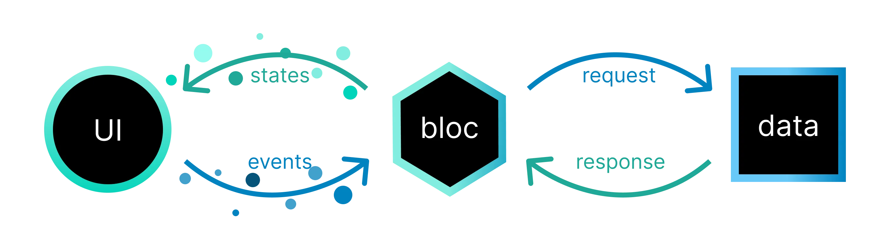

# Bloc

Bloc ist eine beliebte Lösung für State Management in Flutter Anwendungen. Grundsätzlich basiert Bloc auf einer eventgetriebenen Architektur, die große Vorteile für die observability und traceability bietet. Mit Cubits wird allerdings auch eine [vereinfachte Variante angeboten](https://bloclibrary.dev/bloc-concepts/#cubit-vs-bloc), die ohne Events auskommt.

## [Blocs](https://bloclibrary.dev/bloc-concepts/#bloc)

Die grundsätzliche Einheit von Zustand ist ein Bloc Objekt. Diese können genau ein Objekt einer beliebigen Dart-Klasse speichern. Die Manipulation des Zustands  erfolgt generell über Events.

Im unteren Beispiel wird als Zustand ein einfacher `int` gespeichert, der bei jedem `IncrementEvent` um einen erhöht wird. die `emit()` Funktion setzt dabei den neuen Zustand und benachrichtigt alle Komponenten, die von diesem Bloc abhängen.

``` dart
class CounterBloc extends Bloc<IncrementEvent, int> {
	CounterBloc() : super(0) {
		on<IncrementEvent>((event, emit) {
			emit(state + 1);
		});
	}
}
```

Um auf verschiedene Events reagieren zu können, kann die `on()` Methode überladen werden. Für diesen Use Case bieten sich auch [`sealed`](https://dart.dev/language/class-modifiers#sealed) Klassen an.

``` Dart
sealed class CounterEvent {}

final class IncrementEvent extends CounterEvent {}

final class DecrementEvent extends CounterEvent {}

class CounterBloc extends Bloc<CounterEvent, int> {
	CounterBloc() : super(0) {

		on<IncrementEvent>((event, emit) {
			emit(state + 1);
		});

		on<DecrementEvent>((event, emit) {
			emit(state - 1);
		});
	}
}
```

Die Events auslösen, und damit eine Zustandsänderung anstoßen, können wir, indem wir die `add()` Methode nutzen:

```dart
counterBloc.add(IncrementEvent)
```

## [Cubits](https://bloclibrary.dev/bloc-concepts/#cubit)

Cubits funktionieren ähnlich wie Blocs, verzichten aber auf den Eventgetriebenen Ansatz und nutzen stattdessen einfache Methodenaufrufe um Zustandsänderungen anzustoßen. Das vereinfacht die Entwicklung und reduziert Boilerplate Code, opfert dafür jedoch etwas von der Nachverfolgbarkeit, die durch Blocs Events sonst gegeben sind. Mehr über die Motivation hinter Cubits kann in [dieser GitHub Issue](https://github.com/felangel/cubit/issues/69) nachgelesen werden.

```dart
class CounterCubit extends Cubit<int> {
  CounterCubit() : super(0);

  void increment() => emit(state + 1);
  void decrement() => emit(state - 1);
}

...

counterCubit.increment();
```

## [Verwendung in Flutter](https://bloclibrary.dev/flutter-bloc-concepts/)

Bloc bietet Widgets, die die Verwendung in Flutter recht einfach machen:

`BlocProvider` stellt einen gegebenen Bloc in seinem gegebenen Widget Tree zur Verfügung. Dieses Widget sollte in der Hierarchie über jedem Widget auftauchen, das einen Bloc nutzt. Um mehrere Blocs gleichzeitig zur Verfügung zu stellen kann `MultiBlocProvider` verwendet werden. In untergeordneten Widgets kann auf die zur Verfügung gestellten Blocs via `context.read<T>()` oder `BlocProvider.of<T>(context)` zugegriffen werden.

`BlocBuilder` liest den Zustand aus einem gegebenen Bloc und kann diesen in seiner `build()` Methode weiterverwenden. Das Builder Widget baut sich auch automatisch jedes mal neu, wenn der Zustand des Blocs sich ändert. Wollen wir das Widget nur bedingt neu rendern, können wir die bedingung in der `buildWhen()` Methode hinterlegen. Soll eine Funktion ausgeführt werden ohne bestehende Widgets neu zu rendern (etwa das Anzeigen einer Snackbar) ist `BlocListener` das passendere Widget, oder `BlocConsumer`, welches die Funktionen des Builders und des Listeners vereint.

``` Dart
void main() => runApp(CounterApp());

class CounterApp extends StatelessWidget {
  @override
  Widget build(BuildContext context) {
    return MaterialApp(
      home: BlocProvider(
        create: (_) => CounterBloc(),
        child: CounterPage(),
      ),
    );
  }
}

class CounterPage extends StatelessWidget {
  @override
  Widget build(BuildContext context) {
    return Scaffold(
      appBar: AppBar(title: Text('Counter')),
      body: BlocBuilder<CounterBloc, int>(
        builder: (context, count) {
          return Center(
            child: Text(
              '$count',
              style: TextStyle(fontSize: 24.0),
            ),
          );
        },
      ),
    );
  }
}
```

## [Observability](https://bloclibrary.dev/bloc-concepts/#observing-a-bloc)

Die Bloc Klasse hat drei wichtige Methoden für Observability, die jede Implementierung überschreiben kann:

- `onError()` wird aufgerufen, wenn irgendwo in einer Methode des Objekts die `addError()` Methode aufgerufen wird. So können wir Fehler an einem zentralen Ort behandeln.
- `onTransition()` wird bei jedem Übergang in einen neuen Zustand aufgerufen, mit einem `Transition` Objekt, welches den alten und neuen Zustand sowie das Eventobjekt enthält. Da bei der Nutzung von [Cubits](#cubits) keine Events erstellt werden, existiert diese Methode in Cubits nicht und wird bei ihren Zustandsänderungen nicht ausgeführt.
- `onChange()` wird auch bei jedem Übergang aufgerufen, direkt nach der `onTransition()` Methode, und erhält ein `Change` Objekt, welches nur den alten und neuen Zustand enthält, nicht aber das Event. Diese Methode wird auch bei Übergängen in Cubits angesprochen.

Alternativ können wir alle drei Methoden auch in einme zentralen [BlocObserver](https://bloclibrary.dev/bloc-concepts/#blocobserver-1) implementieren, der für alle Übergänge in allen Blocs und Cubits angesprochen wird, und so eine gute Stelle für zentrales Logging und Error Handling bietet.

``` Dart
class SimpleBlocObserver extends BlocObserver {
  @override
  void onChange(BlocBase bloc, Change change) {
    super.onChange(bloc, change);
    print('${bloc.runtimeType} $change');
  }

  @override
  void onTransition(Bloc bloc, Transition transition) {
    super.onTransition(bloc, transition);
    print('${bloc.runtimeType} $transition');
  }

  @override
  void onError(BlocBase bloc, Object error, StackTrace stackTrace) {
    print('${bloc.runtimeType} $error $stackTrace');
    super.onError(bloc, error, stackTrace);
  }
}

void main() {
  Bloc.observer = SimpleBlocObserver();
}
```

## [Architektur](https://bloclibrary.dev/architecture/)

Die Pilosophie von Bloc teilt eine Anwendung in dre Schichten auf: Die Präsentation, die Geschäftslogik und die Datenschicht. Die Präsentation wird hier von Flutter übernommen. Die Datenschicht bildet eine Abstraktion von API Schnittstellen und Netzwerkaufrufen. Die Geschäftslogik, zusammen mit der Zustandsverwaltung, sieht Bloc als seine Aufgabe.


