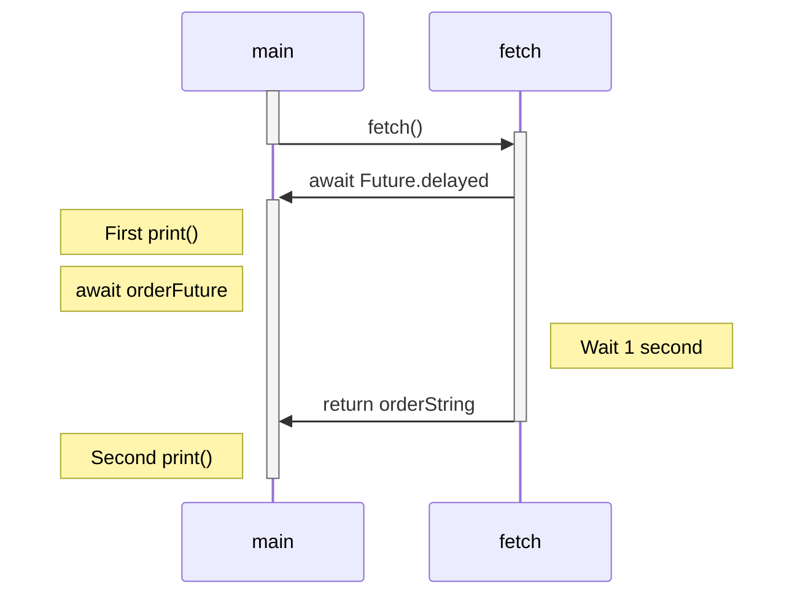
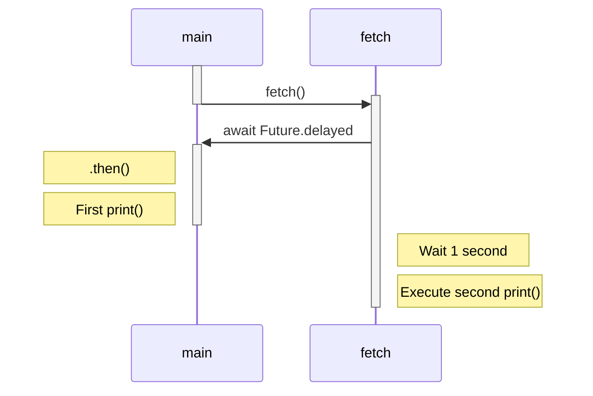

# Dart

Dieses Dokument soll eine kurze Übersicht über die wichtigsten Features von Dart für die Flutter-Entwicklung geben, mit Links zu weiterführenden Informationen in der offiziellen Dokumentation. In `challenges.dart` sind Aufgaben hinterlegt, die zur Übung dienen sollen. Die passenden Tests können aus dem `dart` Verzeichnis mit dem befehl `dart test` ausgeführt werden.

Dart ist eine moderne Programmiersprache mit C-Style Syntax und Garbage Collection, die für multi-plattform Client Entwicklung optimiert ist. Sie lässt sich zu nativem Maschinencode, javascript und WebAssembly kompillieren, und bietet damit hohe Portability. Dart wirbt außerdem mit "Stateful Hot Reload", was schnelle Iteration in der Entwicklung ermöglicht.

## Typsystem

Darts [eingebauten Typen](https://dart.dev/language/built-in-types) sind:

- Numbers
  - int
  - double
- String
- bool
- Runes (praktisch Characters)
- [Collections](https://dart.dev/language/collections)
  - Lists
  - Sets
  - Maps
- [Records](https://dart.dev/language/records)
- [Functions](https://dart.dev/language/functions#function-types)
- Symbols
- Null (mit dem einzigen möglichen Wert `null`)

Dart ist statisch typisiert, jede Variable hat also einen festen, zur Compile-Zeit bekannten Typ. Die Richtigkeit der Zuordnungen wird durch statische Analyse sichergestellt.

```dart
// korrekt
bool boolVariable = true;

// kompilliert nicht
String stringVariable = boolVariable;
```

### [Type Inference](https://dart.dev/language/type-system#type-inference)

Dart unterstützt implizite Typisierung. Ist eine Variable als `var` deklariert, dann ermittelt die statische Analyse zur Compile-Zeit den Wert der Variable.

```dart
// String Variable
var stringVariable = "wert";

// List<String> Variable
var stringList = [stringVariable];
```

Hat die Analyse zu wenig Informationen, um den Typ klar fetzulegen, kann sie die Daten als `dynamic` kennzeichnen und zur Laufzeit alle Objekte zulassen.

```dart
// List<dynamic> Variable
var dynamicList = [];
```

### final und const

Dart unterstützt auch Konstanten. Dabei gibt es zwei verschiedene Arten:  
`final` Variablen werden zur Zeit der Initialisierung berechnet und dürfen dann nicht mehr verändert werden.

```dart
final name = 'Bob'; // Without a type annotation
final String nickname = 'Bobby';
name = 'Alice'; // Error: a final variable can only be set once.
```

Falls die `final` Variable auf ein Objekt mit Attributen verweist, dürfen diese Attribute verändert werden, nicht aber die Referenz, die in der Variable hinterlegt ist.

```dart
class Counter {
  var count = 0;
}

void main() {
  final counter = Counter();
  counter.count++; // Erlaubt
}
```

Eine mit `const` annotierte Variable dagegen wird schon zur Compile-Zeit berechnet, der Wert wird dann vom Compiler eingesetzt. Daher sind hier nur einfache Ausdrücke und keine Funktionsaufrufe erlaubt.

```dart
const bar = 1000000; // Unit of pressure (dynes/cm2)
const double atm = 1.01325 * bar; // Standard atmosphere

baz = [42]; // Error: Constant variables can't be assigned a value.
```

Da `const` Objekte komplett zur Compile-Zeit bekannt sein müssen, können ihre Attribute, im Gegensatz zu `final`, später nicht verändert werden.

### [Typecasts](https://dart.dev/language/operators#type-test-operators)

Die statische Typinferenz ist nützlich, aber nicht perfekt. Daher bietet Dart das keyword `as`, mit dem wir Objekte explizit casten können, wenn wir wissen, welchen Typ es hat.
Sind wir nicht sicher, ob das Objekt einen bestimmten Typ hat, können wir dies mit `is` oder `is!` prüfen:

```dart
void setName(Object employee) {
	if(employee is Persion) {
		(employee as Person).firstName = 'Bob';
	}
}
```

## Null Safety und Nullable Types

### Sound Null Safety

Dart implementiert [Sound Null Safety](https://dart.dev/null-safety). Sprich: Wenn der Compiler feststellt, dass ein Wert nicht `null` ist, dann *kann dieser Wert niemals `null` sein*.

Per default sind alle Variablen *non-nullable*. Sie müssen mit einem valide Wert initialisiert werden, und ihnen kann später nicht `null` zugewiesen werden.

```dart
// Fehler: Muss initialisiert werden
String firstName;

String lastName = "Müller";
// Fehler: Darf nicht null sein
lastName = null;

// Ist immer false
lastName is Null;
```

Die technischen Hintergründe im Typsystem sind [hier](https://dart.dev/null-safety/understanding-null-safety#nullability-in-the-type-system) erklärt.

### Nullable Types

Wollen wir `null` benutzen, können wir *Nullable Types* benutzen, indem wir ein `?` an unseren Typen anhängen. Variablen mit nullable types können entweder einen Wert oder `null` enthalten.

```dart
// Beide Fälle sind jetzt erlaubt.
String? firstName;
firstName = null;
```

### Die Operatoren `?.` und `!`

Auf die Attribute und Methoden von Nullable Types kann nicht direkt zugegriffen werden, da sie ja `null` sein können. Sind wir sicher, dass die Variable nicht `null` ist, können wir den [Non-Null Assertion Operator](https://dart.dev/null-safety/understanding-null-safety#non-null-assertion-operator) `!` benutzen, um die Variable zu einen non-nullable type zu casten. Schlägt dieser cast fehl, wird eine runtime exception geworfen.

Sind wir nicht ganz sicher, ob die Variable `null` ist oder nicht, können wir den binären [Null Aware Operator](https://dart.dev/null-safety/understanding-null-safety#smarter-null-aware-methods) `?.` benutzen. Ist hier die linke Seite null, wird die rechte Seite ignoriert und `null` zurückgegeben. Andernfalls wird die rechte Seite ausgeführt wie normal. Auf diese Weise spart man sich verbose null-checks.

```dart
String? nullableString = "value";
// Hier ist upperCase 'VALUE'
String upperCase = nullableString?.toUppercase();
// Mit ! casten wir String? zu String
String strictString = nullableString!;

nullableString = null;
// Hier ist lowerCase null
String? lowerCase = nullableString?.toLowerCase();
// Fehler: Wirft RuntimeException
strictString = nullableString!;

// Ein Beispiel für verkettete ?. Operatoren:
// Ist user null oder gibt getArticle(3)
// null zurück wird die Ausführung abgebrochen
user?.getBasket().getArticle(3)?.setSize(9);
```

## Klassen

Dart ist eine objektorientierte Sprache und bietet damit natürlich auch die Möglichkeit, eigene Klassen zu definieren. Die meisten Features von Klassen in Dart sind Java-Entwicklern bereits geläufig: Die Schlüsselwörter `class`, `this`, `new`, `extends`, `implements` und `super` werden analog benutzt. Die Namen von privaten Methoden und Properties in Methoden beginnen in Dart mit einem `_`.

### [Konstruktoren](https://dart.dev/language/constructors)

Es gibt in Dart verschiedene Arten von Konstruktoren, die [hier](https://dart.dev/language/constructors) nachgeschlagen werden können. Hier einige der wichtigen:

- Default-Konstruktoren werden genutzt, wenn es keine expliziten Konstruktoren gibt, und nehmen keine Argumente.
- Generative Konstruktoren funktionieren wie aus Java bekannt
- Benannte Konstruktoren haben einen Namen unabhängig von ihrer Kalsse und können eine spezifischere Initialisierung oder "Abkürzung" bieten.
- Factory-Konstruktoren können benutzt werden um vor der Initialisierung nicht-triviale Aufgaben auszuführen oder z.B einen Cache zu nutzen.

```dart
class Point {
	final double x;
	final double y;

	static final Map<String, Point> _cache = <String, Point>{};

	// Generativer Konstruktor
	Point(this.x, this.y);

	// Benannter Konstruktor
	Point.origin() : x = 0.0, y = 0.0;

	// Factory-Konstruktor
	factory Point(String name) {
		return _cache.putIfAbsent(name, () => Point.origin());
	}
}
```

## [Parameter](https://dart.dev/language/functions#parameters)

Funktionen könne in Dart zwei verschiedene Arten von Parametern haben:

- Positional Parameter  
	Die parameter-Liste beginnt mit null oder mehr *Required Positional Parametern*, die wie in Java geschrieben werden. Es können auch *Optional Positional Parameter* folgen, welche [Nullable Types](#nullable-types) haben müssen und in einem `[]` Block stehen.

	```dart
	String say(String from, String msg, [String? device]) {...}
	```

- Named Parameter  
	Parameter mit Namen können den *Required Positional Parametern* folgen, falls es keine *Optional Positional Parameter* gibt, und stehen in einem `{}` Block. Normal sind alle benannten Parameter optional, sie können aber mit `required` annotiert werden. Für diese Parameter können auch default Werte festgelegt werden.

	```dart
	void enableFlags({bool? bold, bool hidden = false, required Widget child}) {
	```

Flutter benutzt praktisch ausschließlich benannte Parameter, meist mit Default Wert.

## Asynchrone Programmierung

### [`async` und `await`](https://dart.dev/libraries/async/async-await)

Wollen wir längere Operationen wie Requests über das Internet machen und dabei den Haupt-Thread nicht blockieren, können wir asynchrone Methoden benutzen. Diese sind mit dem `async` Schlüsselwort annotiert und geben ein [`Future<>`](https://api.flutter.dev/flutter/dart-async/Future-class.html) Objekt zurück, welches analog zu dem Java-Future funktioniert.

Innerhalb von `async` Funtionen können wir das `await` Schlüsselwort verwenden (und NUR innerhalb solcher Funtionen). An dieser Stelle wird ein neuer Neben-Thread angelegt, der den Rest der Funktion ausführt, und im Haupt-Thread wird ein `Future` zurückgegeben. Ist der Neben-Thread fertig, wird das `Future` mit dem errechneten Wert gefüllt.

```dart
Future<String> fetchOrder() async {
  String orderString = await Future.delayed(const Duration(seconds: 1), () => 'Large Latte');
  return orderString;
}

void main() async {
  Future<String> orderFuture = fetchOrder();
  print("Fetching Order...");
  print(await orderFuture);
}
```

Beim Ausführen des Programms können wir eine Pause von einer Sekunde zwischen den Prints beobachten. Hier ein Sequenz-Diagram, das die Ausführung veranschaulicht. Zur richtigen Anzeige ist Mermaid-Support nötig.



Mit diesem Code bleibt der main Thread während seines `await orderFuture` blockiert. Normalerweise wollen wir den main thread *nicht* blockieren, um unsere apps responsive zu halten. Um das zu erreichen können wir die `Future.then()` methode benutzen:

```dart
void main() {
  Future<String> orderFuture = fetchOrder();
  orderFuture.then((orderString) => print(orderString));
  print("Fetching Order...");
}
```



Hier haben wir die Verantwortung für das zweite `print()` ausgelagert, was dem main thread erlaubt andere Aufgaben auszuführen. Beachte, dass die `main` Funktion nun auch nicht mehr `async` ist und entsprechend keine `wait` Instruktionen enthalten *kann*.

Ein interaktives Tutorial zu asynchroner Programmierung ist [hier](https://dart.dev/libraries/async/async-await) zu fiden.

### [Streams](https://dart.dev/libraries/async/using-streams)

Dart bietet mit Streams Funktionalität für asynchrone Sequenzen. Diese können mit einer `async*` Methode erzeugt und mit dem speziellen `await for` Loop verarbeitet werden.

```dart
Stream<int> timedCounter(Duration interval, [int? maxCount]) async* {
  int i = 0;
  while (true) {
    await Future.delayed(interval);
    yield ++i;
    if (i == maxCount) break;
  }
}

void main() async {
  Stream<int> numbers = timedCounter(Duration(seconds: 1), 10);
  await for(final i in numbers) {
    print(i);
  }
}
```

Für mehr Details über Streams siehe die Dokumentation zum [nutzen](https://dart.dev/libraries/async/using-streams) und [erstellen](https://dart.dev/libraries/async/creating-streams) von Streams.

## Networking

*TODO*

## Code Generation

*TODO*

## Weiterführendes

- [Late/Lazy Variablen](https://dart.dev/language/variables#late-variables)
- [Patterns](https://dart.dev/language/patterns)

### [Mixins](https://dart.dev/language/mixins)

Mixins stellen Eigenschaften und Funktionalitäten dar, die in anderen Klassen verwendet werden können. Mixins erlauben es Klassen, Teil mehrerer Klassen-Hierarchien zu sein. Klassen können Mixins mithilfe des Schlüsselworts `with` verwenden.

```dart
mixin Musical {
  bool canPlayPiano = false;

  void entertainMe() {
    if (canPlayPiano) {
      print('Playing piano');
    } else {
      print('Humming to self');
    }
  }
}

class Musician extends Performer with Musical {
  // ···
}

class Maestro extends Person with Musical, Aggressive, Demented {
  // ···
}
```

### [`sealed` Klassen](https://dart.dev/language/class-modifiers#sealed)

Klassen, die mit dem `sealed` modifikator versehen sind, sind implizit abstrakt und können nur innerhalb des eigenen packages implementiert werden. Dadurch sind zur Compile-Zeit alle Untertypen bekannt. Diese können wie ein Enum benutzt werden, und der Compiler kann verifizieren, ob alle möglichen Fälle abgedeckt sind.

```dart
sealed class Vehicle {}

class Car extends Vehicle {}
class Truck implements Vehicle {}
class Bicycle extends Vehicle {}

String getVehicleSound(Vehicle vehicle) {
  // ERROR: The switch is missing the Bicycle subtype or a default case.
  return switch (vehicle) {
    Car() => 'vroom',
    Truck() => 'VROOOOMM',
  };
}
```
