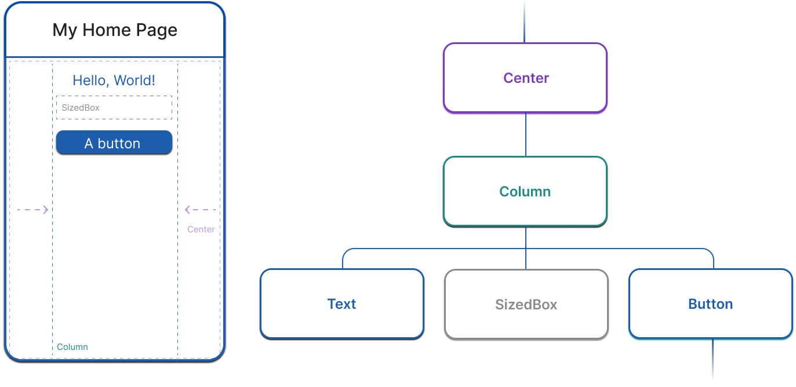
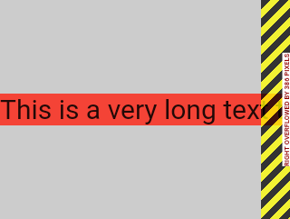

# Flutter

Flutter ist ein Open-Source Framework für Multi-Platform anwendungen. Es basiert auf [Dart](../dart/README.md) und wird von Google entwickelt und unterstützt. Seine Stärke liegt in der schnellen Entwicklung von Mobile-First Anwendungen. Per Default benutzt Flutter das Material 3 Design.

Flutter funktioniert sehr gut mit [VSCode](https://code.visualstudio.com/). Eine Anleitung für die Installation findet sich [hier](https://docs.flutter.dev/get-started/install).

Für eine praktische Einführung in Flutter ist dieses [code lab](https://codelabs.developers.google.com/codelabs/flutter-codelab-first?hl=de#0) zu empfehlen. Mehr über die Grundlagen kann [hier](https://docs.flutter.dev/get-started/fundamentals) nachgelesen werden. Hier gibt es eine kurze Übersicht über die wichtigsten Konzepte und Komponenten.

In diesem Ordner wird auch ein Demo-Projekt zur Verfügung gestellt, welches einige hier beschriebene Konzepte veranschaulicht und zum rumprobieren gedacht ist. Um es zu strten musst du VSCode, Dart und Flutter installiert haben:

1. Öffne `lib/main.dart`
2. Starte es mit dem "Start Debugging" Icon im Editor
3. Wähle eine Platform aus, auf der die App gestartet werden soll

## [Widgets](https://docs.flutter.dev/get-started/fundamentals/widgets)

Widgets sind die haupt Bausteine von Flutter-Anwendungen. Fast alles in Flutter ist ein Widget. Sie sind im Code als Dart-Objekte vertreten und werden als hierarchische Komposition verwendet.

```dart
Center(
	child: Builder(
		builder: (context) {
			return Column(
				children: [
					const Text('Hello, World!'),
					const SizedBox(height: 20),
					ElevatedButton(
						onPressed: () {
							print('Click!');
						},
						child: const Text('A button'),
					),
				],
			);
		},
	),
),

```



Gedanklich kann man Widgets grob in zwei Kategorien einteilen:

- Sichtbare Widgets, die den Inhalt der Anwendung ausmachen (hier Text und Button)
- Layout Widgets, die die Anordnung der Inhalte definieren (hier Center und Column)

Layout Widgets nehmen immer entweder ein `child` Objekt oder eine Liste von `children` als [named parameter](../dart/README.md#parameter), wodurch eine Hierarchie entsteht.

Eigene Widgets können erstellt werden, indem man eine neue Klasse von `StatelessWidget` erben lässt, und eine `build()` Methode definiert. Widgets können auch einen State haben, siehe dazu [State](#state).

```dart
class PaddedText extends StatelessWidget {
  const PaddedText({super.key});

  @override
  Widget build(BuildContext context) {
    return Padding(
      padding: const EdgeInsets.all(8.0),
      child: const Text('Hello, World!'),
    );
  }
}
```

### [Scaffold](https://api.flutter.dev/flutter/material/Scaffold-class.html)

Das `Scaffold` Widget nimmt eine spezielle Stellung in Flutter Apps ein. Es fungiert als Gundlage für unsere Layouts. Einerseits gibt es uns Zugang zu Flutters Material Design, andererseits bringt es Support für häufig genutzte Elemente wie AppBar, Drawer und BottomSheet mit. Es wird meist als direktes Child eines `MaterialApp` Widgets verwendet.

```dart
void main() => runApp(const ScaffoldExampleApp());

class ScaffoldExampleApp extends StatelessWidget {
  const ScaffoldExampleApp({super.key});

  @override
  Widget build(BuildContext context) {
    return const MaterialApp(
		home: Scaffold(
			appBar: AppBar(title: const Text('Example App')),
			body: Center(child: Text('This is our example App :)')),
		),
    );
  }
}
```

Mehr über `Scaffold` findest du in der [Flutter Doku](https://api.flutter.dev/flutter/material/Scaffold-class.html) oder [unter flutter.de](https://www.flutter.de/artikel/was-du-%C3%BCber-das-flutter-scaffold-widget-wissen-solltest).

### Eine Aufzählung von nützlichen Widgets

**Layout:**  
[AppBar](https://api.flutter.dev/flutter/material/AppBar-class.html)
[Expanded](https://api.flutter.dev/flutter/widgets/Expanded-class.html)
[Card](https://api.flutter.dev/flutter/material/Card-class.html)
[Column](https://api.flutter.dev/flutter/widgets/Column-class.html)
[ConstrainedBox](https://api.flutter.dev/flutter/widgets/ConstrainedBox-class.html)
[Container](https://api.flutter.dev/flutter/widgets/Container-class.html)
[LayoutBuilder](https://api.flutter.dev/flutter/widgets/LayoutBuilder-class.html)
[ListView](https://api.flutter.dev/flutter/widgets/ListView-class.html)
[Row](https://api.flutter.dev/flutter/widgets/Row-class.html)
[Scaffold](https://api.flutter.dev/flutter/material/Scaffold-class.html)
[Stack](https://api.flutter.dev/flutter/widgets/Stack-class.html)

**Content & Darstellung:**  
[Image](https://api.flutter.dev/flutter/widgets/Image-class.html)
[Opacity](https://api.flutter.dev/flutter/widgets/Opacity-class.html)
[Text](https://api.flutter.dev/flutter/widgets/Text-class.html)
Theme

**Funktional:**  
[Builder](https://api.flutter.dev/flutter/widgets/Builder-class.html)

## [Layout](https://docs.flutter.dev/get-started/fundamentals/layout)

### [Constraints](https://docs.flutter.dev/ui/layout/constraints)

Layouting in Flutter funktioniert nach dem Motto:

> **Constraints go down. Sizes go up. Parent sets position.**

Sprich: Ein Widget bekommt von seinem Parent gesagt, wie groß es maximal sein darf. Dann erstellt es ein layout aus seinen Children, das mit diesen Constraints kompatibel ist und teilt seinem Parent die seine finale Größe mit. Das Parent-Widget entscheidet dann, wo es Child-Widget positionieren will. Eine anschauliche Erklärung mit vielen Beispielen findest du [hier](https://docs.flutter.dev/ui/layout/constraints).

Wenn es darum geht, die eigene Größe festzulegen lassen sich die Widgets grob in drei Gruppen mit unterschiedlichem Verhalte, einteilen:

- Widgets, die sich so groß machen wie möglich
- Widgets, die nur so groß sind, dass sie um ihre Children passen
- Widgets, die eine festgelegte Größe genau haben wollen (z.B. Bilder)

#### Overflow Error

Kann ein Widget mit den gegebenen Constraints kein sinnvolles Layout erzeugen (z.B. zu viel text, Bild zu groß), dann wird in der dev-Umgebung ein klar erkennbarer Fehler angezeigt:



#### Unbounded Constraints und Unbounded Size Error

Ein Layout-Widget kann seinen Children auch komplett freie Hand bei der Festlegung ihrer Größe lassen, und ihm [Unbounded Constraints](https://docs.flutter.dev/ui/layout/constraints#unbounded-constraints) geben. Das `Column` Widget zum Beispiel schränkt seine Children in Sachen Größe nicht ein, sondern ordnet sie nur untereinander in einer Spalte an.

Geben wir hier ein Widget als Child mit, das sich so groß wie möglich machen will, müsste es unendlich groß sein. Da das aber wenig Sinn ergibt wirft Flutter hier einen **Unbounded Size Error**. Das Prinzip wird auch in [diesem Video](https://www.youtube.com/watch?v=jckqXR5CrPI) anschaulich erklärt.

### Responsive Layout mit LayoutBuilder

Da Flutter auf Multi-Platform Entwicklung ausgerichtet ist wollen wir antürlich auch Designs erstellen können, die Responsive sind. Das [`LayoutBuilder`](https://api.flutter.dev/flutter/widgets/LayoutBuilder-class.html) Widget hilft hier: Es lässt uns eine Builder-Funktion definieren, die jedes mal neu aufgerufen wird, wenn sich die relevanten Constraints ändern, und entsprechend das Widget neu rendern kann.

```dart
Scaffold(
	appBar: AppBar(title: const Text('LayoutBuilder Example')),
	body: LayoutBuilder(
		builder: (BuildContext context, BoxConstraints constraints) {
			if (constraints.maxWidth > 600) {
				return _buildWideContainers();
			} else {
				return _buildNormalContainer();
			}
		},
	),
)
```

## [BuildContext](https://api.flutter.dev/flutter/widgets/BuildContext-class.html)

Jedes Widget hat eine `build()` Methode, die jeweils ein Argument vom Typ `BuildContext` annimmt. Dieser Context enthält Informationen über alle Vorfahren des gerenderten Widgest im Widget-Baum. Der Context kann also genutzt werden um auf Elemente und Informationen weiter oben im Baum zuzugreifen, wie beispielsweise das [Theme](#styling) der App. Dabei wird hier *nur der nächste* Vorfahre mit einem `Theme` gesucht.

```dart
MaterialApp(
	theme: ThemeData(
		textTheme: TextTheme(
			titleMedium: TextStyle(color: Colors.deepOrange, fontSize: 24),
			bodyMedium: TextStyle(color: Colors.deepOrange, fontSize: 16),
		),
	),
	home: AppBody(),
);

class AppBody extends StatelessWidget {
	const AppBody({super.key});

	@override
	Widget build(BuildContext context) {
		return Text(
			"Title",
			// Get the Theme defined in MaterialApp
			style: Theme.of(context).textTheme.titleMedium,
		);
	}
}
```

Im Beispiel oben wird beim Aufruf von `AppBody` ein neuer Context erzeugt, in dem die `MaterialApp` und ihr `TextTheme` vorkommen. In dem Context, der in unserer `MaterialApp` aktuell ist, kommt kein Theme vor, da kein *Ancestor* unseres Widgets einen definiert hat, sondern *erst das Widget selber*. Wollen wir nun alles in ein Widget schreiben, können wir das `Builder` Widget benutzen, um einen neuen Context zu erzeugen:

```dart
MaterialApp(
	theme: ThemeData(
		textTheme: TextTheme(
			titleMedium: TextStyle(color: Colors.deepOrange, fontSize: 24),
			bodyMedium: TextStyle(color: Colors.deepOrange, fontSize: 16),
		),
	),
	// here, the Theme is not included in the Context
	home: Builder(
		// Creating a new Context that includes the Theme
		builder: (BuildContext context) {
			return Text(
				"Title",
				// Get the Theme from above
				style: Theme.of(context).textTheme.titleMedium,
			)
		),
);
```

Für eine Erklärung der `.of(context)` Funktion siehe [InheritedWidget](#inheritedwidget) weiter unten.

Mehr Details über BuildContext fintest du [in der Flutter Dokumentation](https://api.flutter.dev/flutter/widgets/BuildContext-class.html) oder [bei Medium](https://medium.com/@dihsar/understanding-flutter-buildcontext-a-guide-for-developers-367579309f3a).

## Styling

Der Style einer Flutter App kann mit dem Theme definiert werden. Dieser kann für die ganze App oder einen Subtree einzeln definiert werden.

Um der ganzen App einen Style zu geben kann dem `MaterialApp` Widget ein [`ThemeData`](https://api.flutter.dev/flutter/material/ThemeData-class.html) Objekt mitgegeben werden. Die meistgenutzten Attribute von `ThemeData` sind `colorScheme` und `textScheme`, es können aber auch viele andere Aspekte der Darstellung angepasst werden.

```dart
return MaterialApp(
	title: 'ThemeData Demo',
	theme: ThemeData(

		colorScheme: ColorScheme.fromSeed(
			seedColor: Colors.purple,
			brightness: Brightness.dark,
		),

		textTheme: TextTheme(
			displayLarge: const TextStyle(
				fontSize: 72,
				fontWeight: FontWeight.bold,
			),
		),
	),
	home: const Home(),
);
```

Das Styling kann dann in anderen Komponenten via Kontext abgerufen und angewandt werden, wie im [Abschnitt zu BuildContext](#buildcontext) demonstriert.

Um die Darstellung in einem Subtree unserer App anzupassen können wir Widgets in ein `Theme` Widget wrappen. Hierbei können wir entweder ein komplett neues `ThemeData` Objekt erzeugen, oder unser bestehendes mit Änderungen kopieren.

```dart
Theme(
	// New ThemeData
	data: ThemeData(colorScheme: ColorScheme.fromSeed(seedColor: Colors.pink)),
	child: FloatingActionButton(onPressed: () {}, child: const Icon(Icons.add)),
);

Theme(
	// Copy and alter ThemeData
	data: Theme.of(
		context,
	).copyWith(colorScheme: ColorScheme.fromSeed(seedColor: Colors.pink)),
	child: const FloatingActionButton(onPressed: null, child: Icon(Icons.add)),
);
```

Mehr Details dazu stehen [in der Flutter Doku](https://docs.flutter.dev/cookbook/design/themes).

## [State](https://docs.flutter.dev/get-started/fundamentals/state-management#using-inheritedwidget)

Es gibt verschiedene Alternativen für State Management Provider in Flutter. Hier werde ich kurz auf die Werkzeuge eingehen, welches Flutter selber mitbringt. Diese sind vor Allem für simple projekte nützlich, ***werden aber in der Produktion eher nicht benutzt***. Für komplexere Anwendungen sind externe Provider klar die bessere Option. Die zwei meist genutzten Provider [Riverpod](../riverpod/riverpod.md) und [Bloc](../bloc/bloc.md) haben ihre eigenen Readmes, in denen ich näher auf sie eingehe.

### [StatefulWidget](https://api.flutter.dev/flutter/widgets/StatefulWidget-class.html)

Widgets mit Zusatand setzen sich aus einem `StatefulWidget` und einem `State<>` Objekt zusammen. Der State wird dabei vom Widget eingebunden, enthält die (typischerweise privaten) State Variablen und übernimmt die Aufgabe die `build()` Methode zu implementieren.

```dart
class Bird extends StatefulWidget {
  const Bird({
    super.key,
    this.color = const Color(0xFFFFE306),
    this.child,
  });

  final Color color;
  final Widget? child;

  @override
  State<Bird> createState() => _BirdState();
}

class _BirdState extends State<Bird> {
  double _size = 1.0;

  void grow() {
    setState(() { _size += 0.1; });
  }

  @override
  Widget build(BuildContext context) {
    return Container(
      color: widget.color,
      transform: Matrix4.diagonal3Values(_size, _size, 1.0),
      child: widget.child,
    );
  }
}
```

### [InheritedWidget](https://api.flutter.dev/flutter/widgets/InheritedWidget-class.html)

Wer schonmal mit State in Webapps zu tun hatte, kennt vermutlich das "Durchreichen" von Werten im Widget Tree via Konstruktoren. Das kann schnell unübersichtlich und sehr verbos werden. Hier kommen Flutters InheritedWidgets ins Spiel.

Sie werden in den `context` gelegt, und Widgets weiter unten im Tree können dann darauf zugreifen. Hierfür muss das `InheritedWidget` die statischen Methoden `of(context)` und `maybeOf(context)` implementieren.

Greift ein Widget per `.of()` auf das `InheritedWidget` zu, wird eine Abhängigkeit erzeugt, die von Flutter intern verwaltet wird. Diese führt dazu, dass das abhängige Widget neu gebaut wird, sobald sich der State ändert. Um unnötige Updates zu vermeiden kann das `InheritedWidget` ide Methode `updateShouldNotify(oldWidget)` überschreiben.

```dart
class FrogColor extends InheritedWidget {
  const FrogColor({
    super.key,
    required this.color,
    required super.child,
  });

  final Color color;

  static FrogColor? maybeOf(BuildContext context) {
    return context.dependOnInheritedWidgetOfExactType<FrogColor>();
  }

  static FrogColor of(BuildContext context) {
    final FrogColor? result = maybeOf(context);
    assert(result != null, 'No FrogColor found in context');
    return result!;
  }

  @override
  bool updateShouldNotify(FrogColor oldWidget) => color != oldWidget.color;
}

class MyPage extends StatelessWidget {
  const MyPage({super.key});

  @override
  Widget build(BuildContext context) {
    return Scaffold(
      body: FrogColor(
        color: Colors.green,
        child: Builder(
          builder: (BuildContext innerContext) {
            return Text(
              'Hello Frog',
              style: TextStyle(color: FrogColor.of(innerContext).color),
            );
          },
        ),
      ),
    );
  }
}
```

beachte hier, dass das `Builder` Widget einen neuen [BuildContext](#buildcontext) erzeugt, welcher das `FrogColor` Widget enthält und im `Text` Widget benutzt wird.

Ein anschauliches Video zu `InheritedWidget` gibt es [hier](https://www.youtube.com/watch?v=Zbm3hjPjQMk).

### [ValueNotifier](https://api.flutter.dev/flutter/foundation/ValueNotifier-class.html) und [ChangeNotifier](https://api.flutter.dev/flutter/foundation/ChangeNotifier-class.html)

Alternativ bietet Flutter noch das *Listenable* Interface. Die einfachste Implementierung hiervon ist der `ValueNotifier<>`, der genau einen Wert als State speichert. Diesem State kann ein Subtree von Widgets zugeordnet werden, welcher bei Änderungen neu gebaut wird, indem dieser mit einem `ValueListenableBuilder` gewrappt wird.

Falls mehrere Werte oder eigene Funktionalität nötig ist, kann die `ChangeNotifier` Klasse verwendet werden, und dazu der passende `ListenableBuilder`.

```dart
ValueNotifier<int> valueCounterNotifier = ValueNotifier(0);

class CounterNotifier extends ChangeNotifier {
  int _count = 0;
  int get count => _count;

  void increment() {
    _count++;
    notifyListeners();
  }
}

Column(
  children: [

    ValueListenableBuilder(
      valueListenable: valueCounterNotifier,
      builder: (context, value, child) {
        return Text('counter: $value');
      },
    ),
    TextButton(
      child: Text('Increment'),
      onPressed: () {
        valueCounterNotifier.value++;
      },
    ),

    ListenableBuilder(
      listenable: counterNotifier,
      builder: (context, child) {
        return Text('counter: ${counterNotifier.count}');
      },
    ),
    TextButton(
      child: Text('Increment'),
      onPressed: () {
        counterNotifier.increment();
      },
    ),

  ],
)
```

Wie man die Flutter State Komponenten nutzen kann, um eine MVVM-Architektur aufzubauen, kann man [hier](https://docs.flutter.dev/get-started/fundamentals/state-management#using-mvvm-for-your-applications-architecture
) nachlesen.

## Debugging

Dart und Flutter kommen mit [maßgeschneiderten DevTools](https://docs.flutter.dev/tools/devtools). Diese können entweder im Browser oder direkt in VSCoder geöffnet werden. Die normalen Chrome DevTools nützen hier leider wenig, da Flutter kein richtiges DOM erzeugt, sondern die App auf ein Canvas rendert.

Flutter bietet auch ein [Guide](https://docs.flutter.dev/testing/overview) zum Aufsetzen von automatischen Tests.
